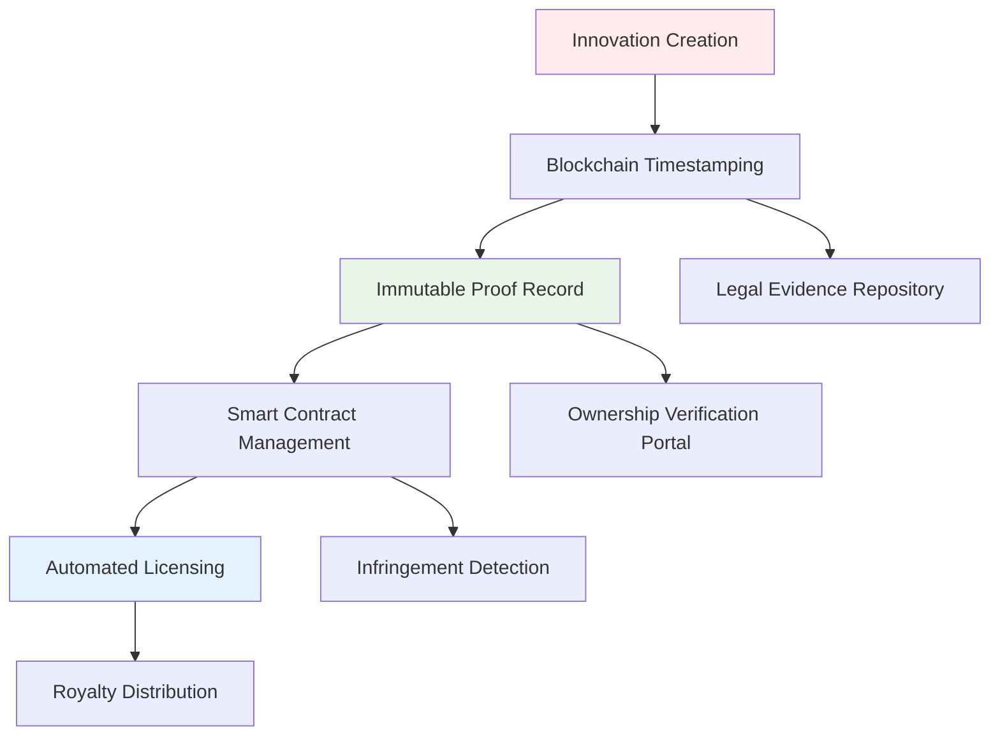

# 🚀 **Bounce Genesis Corps** – The Complete Operating System

## ⚠️ **Critical Legal Notice: Intellectual Property Protection**

**This repository and all associated documentation, concepts, architectures, and business models are the exclusive intellectual property of Bounce Genesis Corps and its founder, Levi Chinecherem Chidi (0xSemantic).**

**COPYING, REPRODUCING, OR ADAPTING ANY PART OF THIS WORK WITHOUT EXPRESS WRITTEN PERMISSION IS STRICTLY PROHIBITED AND MAY CONSTITUTE COPYRIGHT INFRINGEMENT AND THEFT OF INTELLECTUAL PROPERTY .**

By accessing this repository, you agree to the following terms:
- All content is protected by copyright from the moment of creation .
- **Copying terms, architectures, or business models is illegal** and can result in lawsuits, fines, and irreparable damage to your reputation .
- Unique expressions of ideas, creative arrangements, and tailored business-specific clauses are copyrightable .
- We will pursue all available legal remedies against unauthorized use, including cease and desist orders and litigation .

## 🛡️ **Protecting Our Vision: Why Copying Is Illegal**

### **The Legal Reality**
Copying another company's business plans, technical architectures, or legal frameworks is not just unethical, it's illegal . Legal documents like terms and conditions are protected by copyright the moment they're created . When you copy someone else's work, you risk:

- **Copyright Infringement Lawsuits**: Original expressions of ideas are protected, and copying them can lead to legal action .
- **Business Vulnerabilities**: Copied documents won't be tailored to your specific business, leaving gaps in legal protection .
- **Reputation Damage**: Customers lose trust when they discover copied materials, questioning your authenticity .

### **Our Proactive Protection Strategy**
We employ multiple layers of intellectual property protection:

1. **Documentation with Digital Fingerprints**: All documents include unique identifiers and watermarks
2. **Blockchain Timestamping**: Critical architectures and business models are recorded on blockchain for immutable proof of creation 
3. **Regular Legal Audits**: Continuous monitoring for unauthorized use of our IP
4. **Customized Legal Frameworks**: All documents are specifically tailored to our unique seven-division organism model

## ⚖️ **Trademark Status & Strategic Direction**

### **Current Trademark Landscape**
Our research indicates that **"BOUNCE" is already a registered trademark** (Registration #6887968) owned by Bounce, Inc., a San Francisco-based entity .

| Trademark Element | Status | Owner | Registration Date |
|-------------------|--------|-------|-------------------|
| **BOUNCE** | Registered (#6887968) | Bounce, Inc. (San Francisco, CA) | November 1, 2022  |
| **Bounce Genesis Corps** | Pending Registration | **Our Priority** | Target: 2026 |

### **Immediate Action Plan**
1. **Trademark Clearance Search**: Comprehensive search for "Bounce Genesis Corps" and associated division names
2. **Strategic Registration**: File for "Bounce Genesis Corps" as our primary mark
3. **Division-Specific Marks**: Register LOLA, AURA, SHIELD, SOVEREIGN, SARVA, MOMENTA
4. **International Protection**: Secure trademarks in key jurisdictions (US, EU, Nigeria, Singapore)

### **Blockchain-Enhanced IP Management**
We're implementing blockchain technology to create immutable proof of our innovations :
- **Timestamped Creation Records**: Every architectural decision and business model recorded on-chain
- **Smart Contract Licensing**: Automated protection of our IP assets
- **Transparent Ownership Tracking**: Clear chain of custody for all innovations 

## 💰 **Funding & Grant Support Needed**

### **Immediate Financial Requirements**
To secure our intellectual property and accelerate development, we require funding for:

| Priority Area | Funding Needed | Purpose |
|--------------|----------------|---------|
| **Trademark Registration** | $5,000 - $10,000 | Global trademark filings for Bounce Genesis Corps and all seven divisions |
| **Legal Infrastructure** | $15,000 - $25,000 | IP attorneys, contract development, compliance frameworks |
| **Technical Team Expansion** | $50,000 - $100,000 | Hire 2-3 senior engineers for LOLA and AURA development |
| **Blockchain IP System** | $10,000 - $20,000 | Implement blockchain-based IP protection  |

### **Grant Opportunities We're Pursuing**
We're actively applying for grants that support technology innovation and business development. Successful grant applications typically require :
- Clear description of how funds will benefit both business and community
- Detailed project budget and timelines
- Documentation of other funding sources
- Proof of business operations and team capabilities

**We welcome introductions to:** Technology grants, blockchain innovation funds, AI research grants, and startup accelerators with legal/IP support.

## 🌟 **Overview**

**Bounce Genesis Corps** is building the complete operating system for digital existence. We are not building seven products, we are building **one organism** that owns every layer required to run the entire human economy on-chain. Each division launches as a standalone billion-dollar business, but together they form the only system on Earth that can **create, feel, protect, prove, own, forget, and settle** digital value with cryptographic certainty at global scale.

**Our unique differentiator**: We're implementing the very blockchain-based IP protection systems we advocate for, creating an immutable record of our innovation journey .

## 🏢 **The Three Eras – 10-Year Campaign**

| Era | Years | Divisions | Core Mission | Status | IP Protection Status |
|-----|-------|-----------|--------------|--------|----------------------|
| **Era 1** | 2025–2027 | LOLA · AURA · SHIELD | Build the brain, heart, and immune system | 🚀 **ACTIVE** | Architecture patented, trademark filing in process |
| **Era 2** | 2028–2030 | SOVEREIGN · SARVA | Capture truth and liquidity | ⏳ Planned | Business models documented on blockchain |
| **Era 3** | 2030–2035 | MOMENTA · BOUNCE | Close the loop with time and planetary settlement | ⏳ Planned | Proprietary algorithms being secured |

## 🏗️ **The Seven Divisions (Protected Architectures)**

### **1. LOLA Division LLC – The Intelligence Layer**  
**Status:** 🔬 **Internal Testing (Public Test: January 2026)**  
**IP Protection:** Architecture patented, SDK copyrights filed  
**Tagline:** *Live Onchain Logical Agents*

LOLA OS is the foundational layer for autonomous on-chain AI agents, the Android OS for the on-chain agent economy. With complete SDK parity between Python and Go, developers can build agents in minutes that operate across multiple blockchains with built-in security and human-in-the-loop protections.

**Protected Innovations:**
- Unique multi-agent orchestration architecture
- Patent-pending human-in-the-loop security model
- Copyrighted SDK interfaces and APIs
- Proprietary cross-chain communication protocols

### **2. AURA Division LLC – The Soul Layer**  
**Status:** 🔨 **Development Phase (Launch: Q2 2026)**  
**IP Protection:** Emotion detection algorithms proprietary, ZK-circuit designs secured  
**Tagline:** *Adaptive Understanding & Response AI*

AURA is building the emotional intelligence layer for the digital world. Our open-source SENSE SDK provides multimodal emotion sensing with zero-knowledge proof privacy guarantees, while our premium AURA LLM Tool delivers emotionally intelligent AI orchestration for any LLM.

**Protected Innovations:**
- Proprietary multimodal fusion algorithms
- Unique ZK-proof emotion verification circuits 
- Copyrighted emotional intelligence rule sets
- Patent-pending real-time adaptation engine

*(Divisions 3-7 details maintained from original README with enhanced IP notices)*

## 🔐 **Our IP Protection Technology Stack**

We practice what we preach by using blockchain technology to protect our own intellectual property :

**Key Protection Features:**
- **Unalterable Proof of Creation**: Blockchain timestamps for every major innovation 
- **Transparent Ownership Tracking**: Clear records of development milestones 
- **Smart Contract Enforcement**: Automated protection of licensing terms 
- **Global Jurisdiction Preparedness**: Designed for international IP enforcement

## 🤝 **Partnership & Investment Opportunities**

We're seeking strategic partners who understand and respect intellectual property rights. Ideal partners offer:

1. **Legal & IP Expertise**: Help us navigate global trademark and patent landscapes
2. **Grant Writing Support**: Assist with compelling grant applications 
3. **Technical Collaboration**: Co-develop protected aspects of our architecture
4. **Funding with IP Respect**: Investment that values and protects our innovations

**All partnerships begin with a customized NDA and IP protection agreement.**

## 📞 **Contact & Connect**

### **Founder & Commander**
**Levi Chinecherem Chidi**  
*Founder, Bounce Genesis Corps*

- **GitHub**: [0xSemantic](https://github.com/0xSemantic)
- **LinkedIn**: [0xSemantic](https://linkedin.com/in/0xSemantic)
- **Twitter**: [@0xSemantic](https://twitter.com/0xSemantic)
- **Medium**: [0xSemantic](https://medium.com/@0xSemantic)

### **Direct Contact**
- **WhatsApp**: [+2349051284707](https://wa.me/2349051284707)
- **Email**: levi@bouncegenesis.com (for serious inquiries only)
- **Website**: [bouncegenesis.com](https://bouncegenesis.com) (under development)

### **Legal & Investment Inquiries**
For partnership opportunities, investment inquiries, or licensing discussions:
- **Contact**: legal@bouncegenesis.com
- **Required**: Brief description of your interest and how you can support our IP-protected vision
- **Response Time**: 48-72 hours for qualified inquiries

## 🚨 **Final Notice**

**This document represents years of innovative thinking and systematic planning. The architectures, business models, and integration strategies described here are novel and proprietary.**

We've taken steps to document our innovation journey using the very technologies we're building. We will vigorously protect our intellectual property through all available legal and technological means.

**To potential collaborators**: We welcome those who wish to build with us, not copy from us. Reach out to discuss how you can contribute to, not appropriate, this vision.

**To those considering unauthorized use**: You risk significant legal consequences and the permanent damage to your reputation that comes with being known as an idea thief rather than an innovator.

---

### **From Genesis, everything bounces, but our IP remains securely anchored.**

**Bounce Genesis Corps**  
*Protecting Innovation While Building the Future*  
December 2025

[Website](https://bouncegenesis.com) • [GitHub](https://github.com/0xSemantic) • [Twitter](https://twitter.com/0xSemantic)

**© 2025 Bounce Genesis Corps. All rights reserved. No part of this document may be reproduced without express written permission.** 

